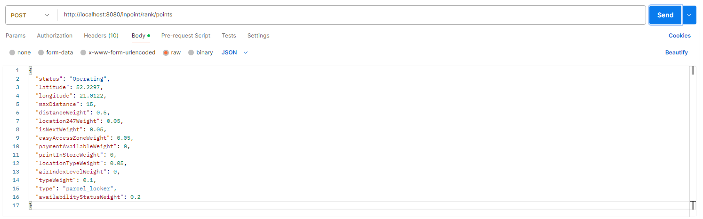
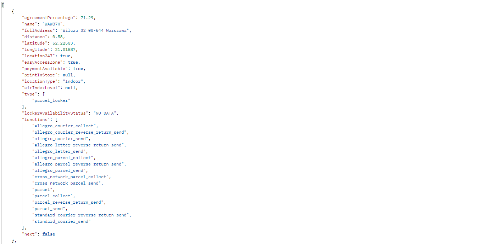

_# InPoint — Top Rated Parcel Lockers

## Author

- **Name:** Oskar Zawadzki
- **Email:** oskarz143@onet.pl

## Overview

I built a service that helps users find the best InPost parcel locker based on their own needs. The system analyzes many features and returns the top 10 lockers with a percentage score. You can set a weight for each feature to decide what is most important to you.

## Demo & Description

1. **Reactive Data Loading:** When the application starts, it downloads data  points using reactive programming. This process is very fast and takes about 10 seconds to complete.
2. **Filtering:** When you send a request, the system first filters the lockers. It only considers points that are within the "max distance" you provided.
3. **Scoring Engine:** The system looks at the weights you gave to different features. It calculates a score for each locker to see how well it matches your preferences.
4. **Ranking Results:** Finally, the system picks the top 10 best-matching lockers. The API returns these lockers sorted by a percentage score, along with all the necessary details about each point

### How the Engine Works
1.  **Components:** In the `RankingService`, I created a list of `ScoreComponent` objects. Each component knows how to get a specific weight from the user's request and how to calculate a score for a specific locker feature. This makes the system very easy to expand with new features in the future.
2.  **Normalization (0.0 to 1.0):** Every feature is converted into a normalized value between **0.0 (worst)** and **1.0 (best)**:
    - **Binary Features:** For features like `isLocation247`, `isPaymentAvailable`, or `isEasyAccessZone`, the engine simply returns **1.0** if the feature is present and **0.0** if it is not.
    - **Enum & Status Features:** For more complex data, I used `switch` expressions. For example, `AirIndexLevel` is graded on a scale: `VERY_GOOD` gets **1.0**, `GOOD` gets **0.8**, down to `VERY_BAD` which gets **0.0**. Similarly, `LockerAvailabilityStatus` gives a high score for `NORMAL` and a very low score for `VERY_LOW` status.
    - **Distance Feature:** I used the **Haversine formula** to get the exact distance in kilometers. Then, I applied a "Distance Decay" formula. This ensures that the score doesn't just disappear at a certain distance, but drops naturally as the locker gets further away.
3.  **The Weighted Calculation:** For every locker, the engine performs the following calculation:
    - It multiplies the **User's Weight** (how much they care about the feature) by the **Locker's Score** (how good that feature is at that location).
    - It sums these values up to get the `totalEarnedScore`.
4.  **Percentage Matching:** Finally, the system compares the `totalEarnedScore` against the maximum possible score (`totalWeight`).



## Technologies

- **Java 21:**
- **Maven**
- **Spring Boot**
- **Spring Mvc**
- **Spring WebFlux**
- **Lombok** 
- **Jakarta Validation**

## How to run

### Prerequisites

- **Java 21** or higher
- **Maven 3.9+**
- Internet access

### Build & run

```bash
# Clone 
https://github.com/oSkarinio143/InPoint.git
cd .\InPoint\

# Build 
mvn clean install

# Run 
mvn spring-boot:run
```
### Example API Usage

You can test the application by:

sending **POST** request on: `http://localhost:8080/inpoint/rank/point`  
**Body (JSON with example data):** (Note: Weights can sum to more than 1.0; the system will adjust the result automatically, but every single one must be in range 0-1)
```json
{
  "status": "Operating",
  "latitude": 52.2297,
  "longitude": 21.0122,
  "maxDistance": 15,
  "distanceWeight": 0.5,
  "location247Weight": 0.05,
  "isNextWeight": 0.05,
  "easyAccessZoneWeight": 0.05,
  "paymentAvailableWeight": 0,
  "printInStoreWeight": 0,
  "locationTypeWeight": 0.05,
  "airIndexLevelWeight": 0,
  "typeWeight": 0.1,
  "type": "parcel_locker",
  "availabilityStatusWeight": 0.2
}
```
## What I would do with more time

1.  **Units & integrational tests**
2.  **Additional Endpoints:** I would add an endpoint for city rankings and second endpoint to find the best points between two sets of coordinates.
3.  **Persistent Storage:** Integrate Redis or H2, to handle data more efficiently.

## AI usage

I used AI tools (Gemini) to:
- **Validation & Boilerplate:** Speeding up the creation of DTOs and Jakarta Validation messages.
- discuss different ways to solve problems, like how to handle the ranking logic or what is the best way to fetch all the points from the API.
- Creating the initial code, then analyzing and cleaning it to ensure it works correctly. I verified every code block and tested the ranking outcomes
- helping me create the formula for the ranking system

## Anything else?_

**Distance Sensitivity:** I realized that for a user, a locker 50 meters away and 100 meters away are almost the same. But 1 km vs 2 km is a big difference. I added a "sensitivity" factor to the distance formula so the score doesn't drop too fast for very short distances, but starts dropping faster as the distance grows. This makes the ranking feel more natural. MaxDistance also matters in final result